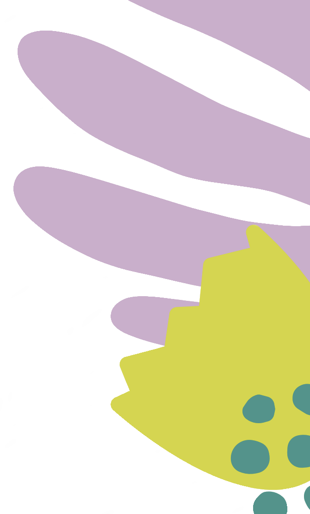
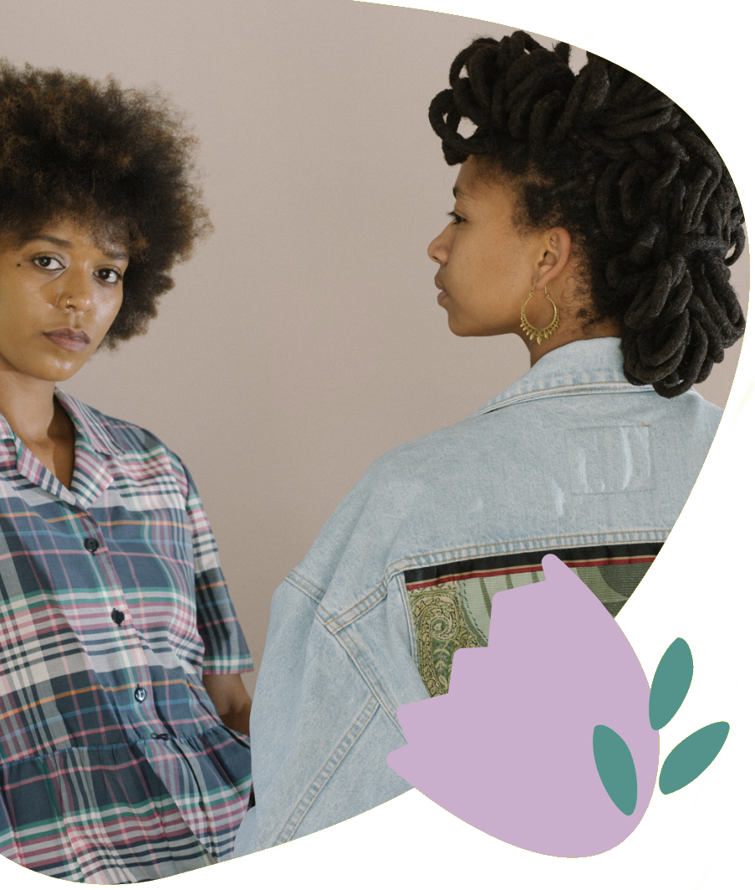

# Documentation for Jaycee's contributions

> The below code depicts everything in the header area which was the part I was supposed to do. The images
 are labeled correctly and depict the two leaf images on the left and right. The paragraph tag dipicts
 how important being eco friendly is to Anissa Tam & Co. and it is located in the middle-ish of the header.
 The final image is the middle image which is an image that was provided in the initial pdf file.

```html
<div id="header">
  
  
  <div class="message-holder">
    <p id="eco-friendly-message">
      Eco-Friendly practice beyond sustainable materials, Anissa TamCo.
      implements eco-friendly practices in every aspect of its operations. This
      inclues energy-efficient manufacturing, minmal packaging, and recycling
      program for used garments.
    </p>
    
  </div>
</div>
```

> The first section of css describes the outer layer of the header and just set up how big the header was
going to be. The second section describes the styling for the paragraph and how it was aligned into the middle
of the header. The next two sections are the same except for the float element and it helps dipict where
each leaf is supposed to go on the header. The message holder was a div that contained the middle image
and the text. The final section is the css to style the middle image.

```css
#header {
  width: 90vw;
  height: 45vh;
  background-color: #faf0e6;
  margin: auto;
  margin-top: 2.5%;
}
p#eco-friendly-message {
  width: 14vw;
  height: 35vh;
  margin-left: 28%;
  padding-top: 3%;
  font-family: 'Playfair Display', serif;
}
img#leaves-left {
  height: 45vh; 
  width: 20vw; 
  float: left;
}
img#leaves-right {
  height: 45vh; 
  width: 20vw; 
  float: right;
}
.message-holder {
  position:relative
}
img#fashion-models {
  position: absolute;
  height: 40vh; 
  top: 7%;
  left: 45%;
}
```